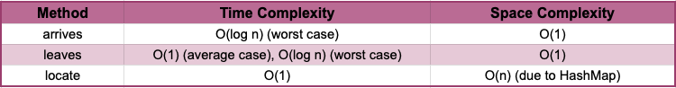

# Hello Midokura! 🌸

## Introduction
This repository contains the Java code implementing a solution for Midokura's Seating Manager coding challenge.

## Runtime Environment
- Java Runtime Version: 17.0.10+8-b1207.12 (x86_64)
- VM: OpenJDK 64-Bit Server VM by JetBrains s.r.o.

## Project Structure

**SeatingManager:** this class manages the seating arrangements for customer groups. It provides functionalities for:

- Arriving customer groups: attempts to seat arriving groups at available tables based on their size.
- Leaving customer groups: handles the departure of customer groups, updating table availability and potentially seating waiting groups.
- Locating customer groups: retrieves the table where a specific customer group is currently seated (if any).

**Table:** Represents a table with a specific size (number of seats) and the amount of available seats.

**CustomerGroup:** Represents a group of customers with a specific size (number of people). 

**ValidationUtil (Optional):** this class might be used for input validation (e.g., ensuring valid group sizes). 

## Testing
The code includes unit tests in the SeatingManagerTest file. These tests utilize the JUnit framework to verify the functionality of the SeatingManager class under various scenarios, including:
- Seating customer groups with different sizes at available tables.
- Handling the situation where no suitable tables are available for arriving groups.
- Removing customer groups from tables and seating waiting groups (if applicable).
- Locating customer groups based on their ID.

## Approach
This solution utilizes several data structures to achieve efficient seating management and group location:
- TreeMap for available seats
- PriorityQueue for tables within an available size category
- HashMap for Group Location
- FIFO Queue for waiting list 

This combination of data structures provides a balance between efficient searching for available tables, space optimization by prioritizing smaller tables, and fast group location through the HashMap. The choice of using a HashMap for location is a reasonable trade-off considering the limited number of tables in a typical restaurant setting.

I used a TreeMap to manage available tables based on their seating capacity. The key in the TreeMap represents the number of empty seats available at a table.
So, each key corresponds to a specific table availability (e.g., a key of 4 represents tables with 4 empty seats).

**Why TreeMap?**

The TreeMap is a self-balancing sorted map that keeps its key-value pairs ordered based on the key. In this case, the TreeMap is sorted in descending order of available seats. 

When a customer group arrives, the search for a suitable table starts with tables having the highest available seats (matching or exceeding the group size). This reduces the number of comparisons needed to find a table that can accommodate the group.

**The PriorityQueue**

Each key in the TreeMap is associated with a value, which is a PriorityQueue.
This PriorityQueue stores the actual Table objects that have the corresponding number of empty seats. The PriorityQueue is ordered by the total size of the tables in ascending order. This means tables with a smaller total capacity are prioritized within the available seats category.

By prioritizing smaller tables, the solution aims to efficiently manage space. It attempts to seat groups at the smallest tables that can accommodate them. This helps to maximize the number of groups that can be seated at the same time.

## Big-O and Space Complexity
Here's a summary of the Big-O and Space Complexity analysis for the key methods in SeatingManager

## Possible Improvements
While this solution effectively addresses the core challenge, with more time or for a more comprehensive implementation, some improvements could be considered

- Implement more robust error handling for invalid inputs and edge cases.
- Consider adding unit tests to cover a wider range of scenarios.
- Explore using alternative data structures for optimized performance with a large number of tables.
- Investigate implementing a priority queue for the waiting list.
- Consider data persistence through database integration for long-term storage.
- Explore building an API for interaction with external systems.
